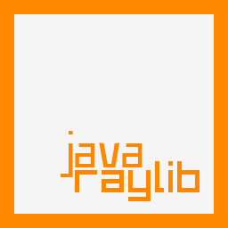

# raylib4j

*RayLib Modern bindings for java.* Its a simple and easy-to-use way to enjoy videogames programming.

raylib is highly inspired by Borland BGI graphics lib and by XNA framework and it's especially well suited for prototyping, tooling, graphical applications, embedded systems and education.

this project include not only bindings themself, but native libraries too.

*NOTE for ADVENTURERS: raylib is a programming library to enjoy videogames programming; no fancy interface, no visual helpers, no debug button... just coding in the most pure spartan-programmers way.*

Ready to learn? Jump to [code examples!](https://www.raylib.com/examples.html)

---

 

Hello world code
------

